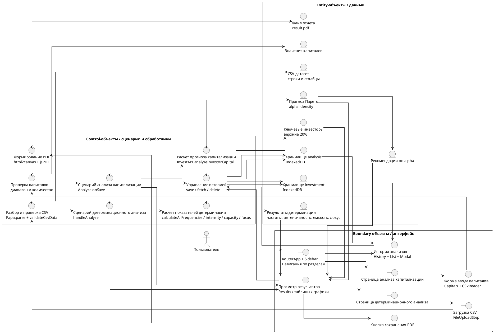

# Диаграмма анализа устойчивости системы

Система: веб-приложение «Платформа для прогнозирования капитализации инвестиционных фондов».

## Robustness Diagram

## Краткое описание элементов

| Тип | Элемент | Назначение |
| --- | --- | --- |
| Actor | Пользователь | Загружает данные, запускает анализ, просматривает результаты и историю. |
| Boundary | RouterApp + Sidebar | Обеспечивает переходы между главной страницей, анализом, детерминационным анализом, историей и контактами. |
| Boundary | Capitals + CSVReader | Принимает значения капиталов вручную или из CSV-файла. |
| Boundary | FileUploadStep | Принимает CSV-файл для детерминационного анализа и показывает состояние загрузки. |
| Boundary | Results / таблицы / графики | Отображает график прогноза, ключевых инвесторов, рекомендации, частоты, интенсивность, емкость и фокусный анализ. |
| Boundary | History + List + Modal | Показывает сохраненные результаты и позволяет удалить запись. |
| Control | Analyze.onSave | Запускает сценарий анализа капитализации и передает результаты на сохранение и отображение. |
| Control | InvestAPI.analyzeInvestorCapital | Рассчитывает параметр alpha, прогноз по распределению Парето и список ключевых игроков. |
| Control | Papa.parse + validateCsvData | Разбирает CSV-файл и проверяет корректность данных. |
| Control | handleAnalyze | Управляет этапами детерминационного анализа и прогрессом выполнения. |
| Control | deterministic-calculations | Рассчитывает одиночные и парные частоты, интенсивность, емкость, фокусный анализ и существенность. |
| Control | IndexedDB API | Сохраняет, получает и удаляет результаты анализа. |
| Entity | Значения капиталов | Входной массив числовых значений для инвестиционного анализа. |
| Entity | Прогноз Парето | Результат расчета: alpha и точки графика плотности/вероятности. |
| Entity | Ключевые инвесторы | 20% инвесторов с наибольшими капиталами. |
| Entity | CSV-датасет | Табличные данные, используемые для детерминационного анализа. |
| Entity | Результаты детерминации | Частоты, интенсивность, емкость, фокусные и уточняющие показатели. |
| Entity | IndexedDB investment / analysis | Локальное браузерное хранилище сохраненных анализов. |
| Entity | result.pdf | PDF-отчет, сформированный на странице результатов. |

## Основные сценарии

1. Пользователь переходит в раздел анализа капитализации, вводит капиталы вручную или загружает CSV, система проверяет данные, рассчитывает alpha, прогноз Парето, ключевых игроков, отображает рекомендации и сохраняет результат в историю.
2. Пользователь переходит в раздел детерминационного анализа, загружает CSV, система проверяет структуру файла, рассчитывает условные частоты, интенсивность, емкость и фокусный анализ, после чего результат можно сохранить в историю.
3. Пользователь открывает историю, система получает сохраненные записи из IndexedDB, показывает карточки анализов и позволяет удалить ненужную запись.
4. Пользователь на странице результатов инвестиционного анализа формирует PDF-отчет.
